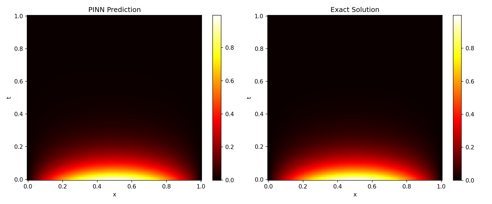
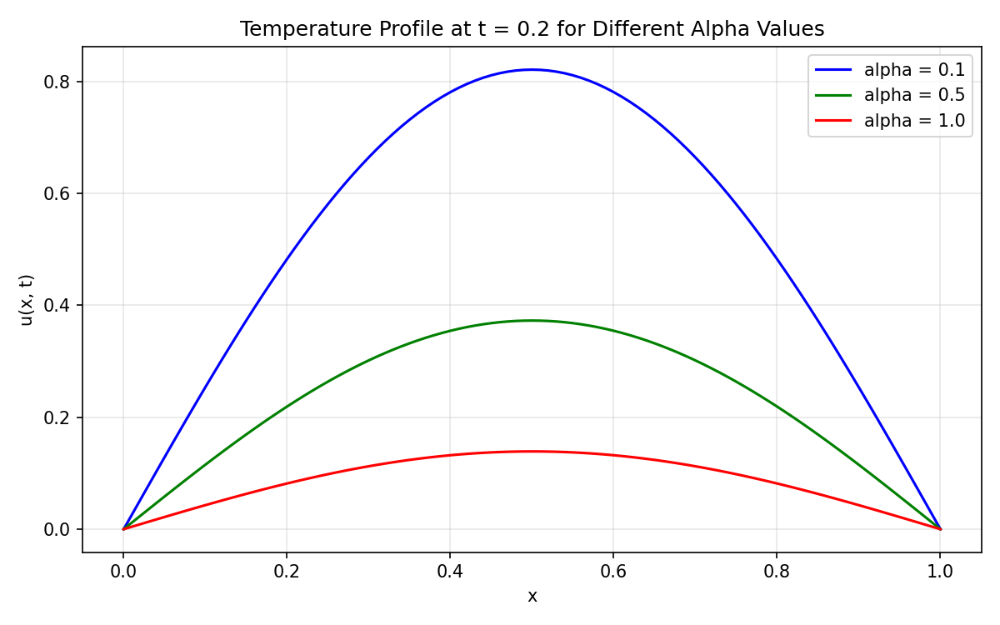
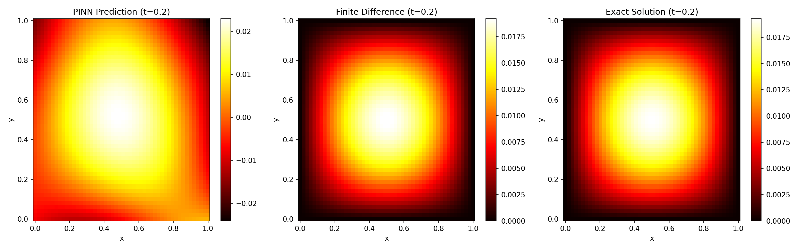

# Physics-Informed Neural Networks for the Heat Equation: A Comparison with Classical Numerical Methods

A mathematical modelling and scientific computing project demonstrating how neural networks can be used to solve partial differential equations, validated against classical numerical methods and an exact analytical solution.

## Project Overview

This project implements a Physics-Informed Neural Network (PINN) to approximate the solution of the heat equation, first in one spatial dimension and then extended to two spatial dimensions. Instead of learning from labeled data, the neural network learns by satisfying the governing partial differential equation (PDE) directly, along with the initial and boundary conditions.

To validate the PINN's accuracy, its predictions are compared against a classical Finite Difference Method (FDM) solver and an exact analytical solution. This allows a quantitative, scientific assessment of how well the neural network approximates the true physics, rather than relying on visual comparison alone.

## Interdisciplinary Relevance

This project sits at the intersection of several fields:

- Mathematics: partial differential equations, analytical solutions, parameter-dependent behaviour
- Scientific Computing: finite difference discretization, numerical stability, automatic differentiation
- Artificial Intelligence: neural network design, optimization, physics-informed loss functions
- Physical Application: heat diffusion, a process relevant to thermal engineering, materials science, and biomedical heat transfer modelling

The project's structure reflects a typical computational mathematics workflow: formulate the mathematical model, solve it with an established numerical method, solve it with a modern machine learning approach, and rigorously compare the two.

## Part 1: The 1D Heat Equation

### Mathematical Formulation

u_t = alpha * u_xx

Domain: 0 <= x <= 1, 0 <= t <= 1

Initial condition: u(x, 0) = sin(pi * x)
Boundary conditions: u(0, t) = 0 and u(1, t) = 0

These conditions were chosen because they admit a known exact solution:

u(x, t) = sin(pi * x) * exp(-pi^2 * alpha * t)

This allows both the PINN and the FDM solution to be validated against ground truth.

### Methods Compared

1. Exact analytical solution (ground truth)
2. Finite Difference Method (FDM) — a classical grid-based numerical solver
3. Physics-Informed Neural Network (PINN) — trained by minimizing a loss composed of the PDE residual, initial condition error, and boundary condition error

### 1D Results

| Method | MAE | RMSE | Max Error |
|--------|-----|------|-----------|
| PINN | 0.000788 | 0.001028 | 0.006741 |
| Finite Difference | 0.000009 | 0.000016 | 0.000051 |

Both methods achieve very low error relative to the exact solution. The finite difference method is more precise, which is expected: FDM directly discretizes the equation on a grid, while the PINN must learn the solution through optimization. The PINN's strength is not raw precision on simple, well-posed problems like this one, but its flexibility to handle irregular domains, sparse data, and complex physics without requiring a mesh — advantages that become more relevant in harder problems.

### Parameter Study: Effect of Thermal Diffusivity (alpha)

To study how the physical parameter alpha affects the solution, the finite difference solver was run for three values: alpha = 0.1, 0.5, and 1.0, and the temperature profile was compared at a fixed time (t = 0.2).

A smaller alpha causes heat to diffuse more slowly, so more heat remains concentrated near the center at a given time. A larger alpha causes faster diffusion, so the temperature profile flattens more quickly. This confirms the expected physical behaviour of the heat equation and demonstrates the model's sensitivity to its governing parameter — an important aspect of mathematical modelling beyond a single fixed case.

## Part 2: Extension to the 2D Heat Equation

To explore how the approach generalizes to higher-dimensional problems, the same computational framework was extended to two spatial dimensions, with the PINN and FDM solutions validated against the corresponding analytical solution, modelling heat diffusion across a 2D plate.

### Mathematical Formulation

u_t = alpha * (u_xx + u_yy)

Domain: 0 <= x <= 1, 0 <= y <= 1, 0 <= t <= 1

Initial condition: u(x, y, 0) = sin(pi * x) * sin(pi * y)
Boundary conditions: u = 0 on all four edges of the square domain

Exact solution:

u(x, y, t) = sin(pi * x) * sin(pi * y) * exp(-2 * pi^2 * alpha * t)

### 2D Results (snapshot at t = 0.2)

| Method | MAE | RMSE | Max Error |
|--------|-----|------|-----------|
| PINN | 0.003940 | 0.005413 | 0.024093 |
| Finite Difference | 0.000029 | 0.000037 | 0.000083 |

### Key Observation: Dimensionality and Error

Moving from one to two spatial dimensions increased the PINN's error more substantially than the finite difference method's error. In 1D, the PINN's maximum error was approximately 0.0067; in 2D it increased to approximately 0.024. In this experiment, the FDM error remained substantially smaller as the problem was extended from 1D to 2D. This reflects a known characteristic of physics-informed neural networks: as the input space grows and more boundary constraints must be satisfied simultaneously, the optimization landscape becomes harder to navigate precisely. This observation highlights both the promise and the current limitations of PINNs as an alternative to classical numerical solvers.

## What is a PINN?

A Physics-Informed Neural Network is a neural network trained to satisfy a physical law, expressed as a differential equation, rather than being trained only on labeled data. The network takes spatial and temporal coordinates as input and predicts the solution at that point. Using automatic differentiation, the derivatives required by the PDE are computed directly from the network's output, and the PDE residual is minimized during training alongside the initial and boundary condition errors.

## Methodology Summary

1. The neural network takes coordinates (x, t) or (x, y, t) as input and outputs a predicted temperature.
2. Automatic differentiation computes the required derivatives directly from the network.
3. The PDE residual is calculated and squared to form a loss term.
4. Initial condition and boundary condition losses are added to anchor the solution.
5. The combined loss is minimized using the Adam optimizer.
6. The trained network's predictions are compared against a finite difference solution and, where available, an exact analytical solution.

## Project Structure

PINNs-Heat-Equation/
- README.md
- requirements.txt
- src/
  - model.py (1D neural network architecture)
  - train.py (1D training loop)
  - predict.py (1D prediction, FDM comparison, error analysis)
  - fdm_solver.py (1D finite difference solver)
  - alpha_comparison.py (parameter study across alpha values)
  - model_2d.py (2D neural network architecture)
  - train_2d.py (2D training loop)
  - predict_2d.py (2D prediction, FDM comparison, error analysis)
  - fdm_2d.py (2D finite difference solver)
- results/
  - heat_solution.png
  - alpha_comparison.png
  - heat_solution_2d.png

## Installation

git clone https://github.com/fizailyas783-ctrl/PINNs-Heat-Equation.git
cd PINNs-Heat-Equation
pip install -r requirements.txt

## How to Run

1D pipeline:

cd src
python train.py
python predict.py
python alpha_comparison.py

2D pipeline:

python train_2d.py
python predict_2d.py

This project can also be run directly in Google Colab without any local installation.

## Mathematical Explanation

- PDE Residual: measures how far the network's output is from satisfying the governing equation. A residual of zero means the equation is perfectly satisfied.
- Automatic Differentiation: computes derivatives of the neural network with respect to its inputs without using finite-difference approximations.
- Initial Condition: anchors the solution at the starting time, preventing the network from converging to a trivial or incorrect solution.
- Boundary Conditions: constrain the solution's behaviour at the edges of the domain, ensuring physical consistency.
- Finite Difference Method: approximates derivatives using neighbouring grid values, providing a classical, mesh-based baseline for comparison.

## Technologies Used

- Python
- PyTorch
- NumPy
- SciPy
- Matplotlib

## Limitations

- The 1D and 2D cases use simple, symmetric domains and boundary conditions chosen for mathematical tractability.
- Each model is trained for a single fixed value of alpha (though alpha's effect is explored separately via the finite difference solver).
- This project is a computational study demonstrating and comparing classical and physics-informed approaches for solving diffusion equations, rather than a production-scale simulation tool.

## Future Improvements

- Explore different initial and boundary conditions
- Train PINNs across a range of alpha values directly, rather than only via the FDM parameter study
- Investigate adaptive sampling strategies to improve PINN accuracy in higher dimensions
- Extend the comparison to more challenging or irregular geometries
